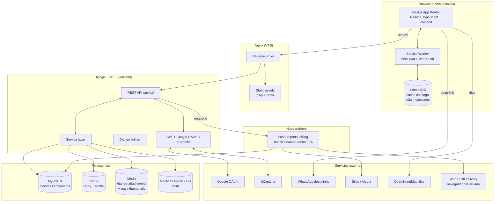
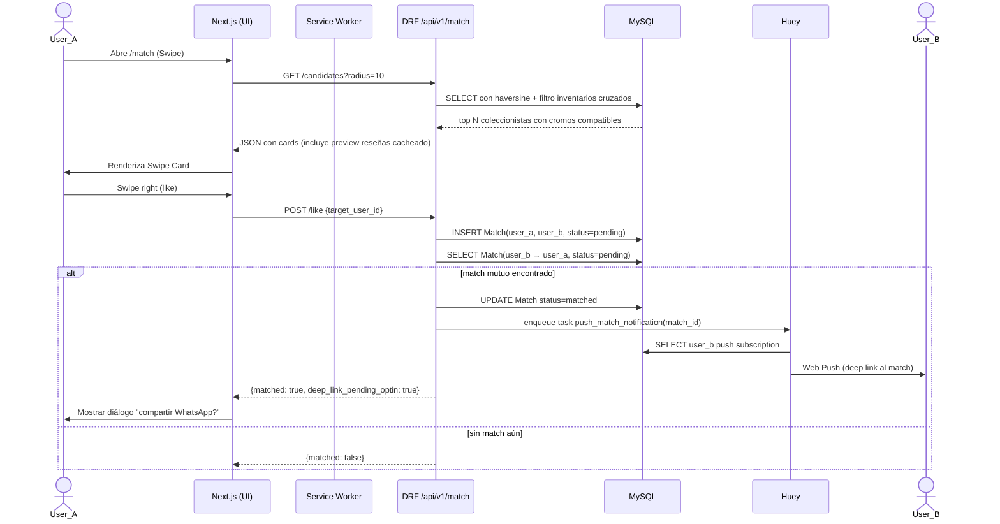
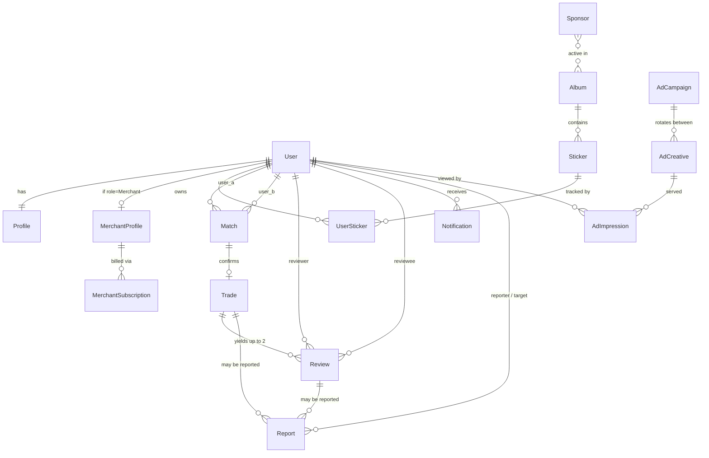
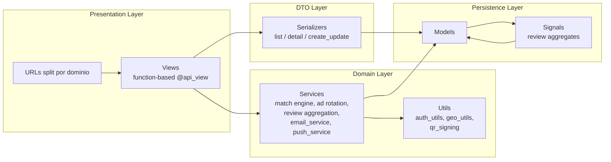
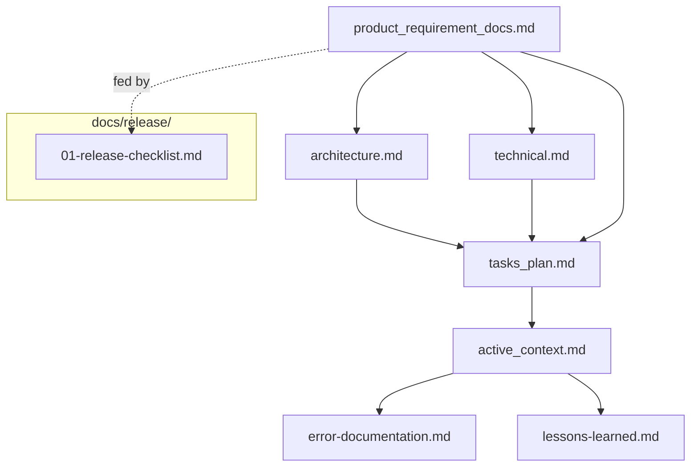
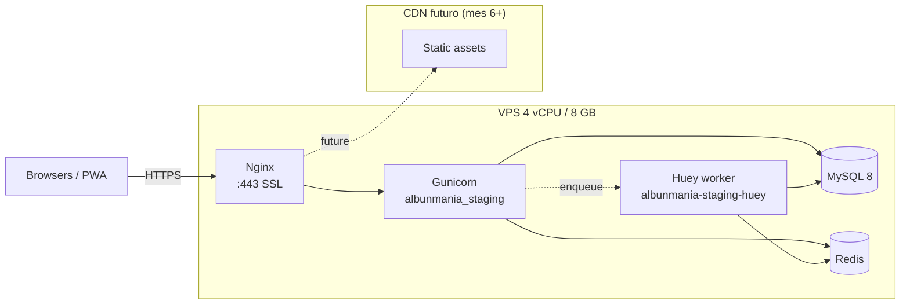

# Architecture — Albunmanía

## 1. System overview

## 2. Request flow — Match swipe (Epic 3 referencia)

## 3. ER Diagram — Modelos del release 01

**Modelos del release 01 (15):**
User, Profile, MerchantProfile, Album, Sticker, UserSticker, Match, Trade, Review, Sponsor, MerchantSubscription, AdCampaign, AdCreative, AdImpression, Report, Notification.

**Constraints críticos:**
- `Profile.rating_avg / rating_count / positive_pct` — agregados cacheados, recalculados via signal post_save/post_delete sobre Review.
- `Review` UNIQUE `(trade_id, reviewer_id)` + ventana de edición 24h post-creación.
- `Sponsor` solo 1 con `active_from <= now() <= active_until`.
- `UserSticker` UNIQUE `(user_id, sticker_id)` con índice compuesto.
- `Match.channel` enum: `digital_swipe | qr_presencial`.
- `AdImpression` particionada por mes.

## 4. Capas y boundaries

## 5. Workflow de desarrollo (Memory Bank flow)

## 6. Deployment topology (objetivo)

## 7. Decisiones arquitectónicas clave

| Decisión | Razón |
|----------|-------|
| **Single Django app** (`albunmania_app`) | Simplicidad para release 01; el dominio cabe sin necesidad de splitting; coherente con el patrón del template que ya validamos |
| **Multi-álbum como tenant lógico** (Album es la raíz, no schema/db) | Soporta Mundial 26 + Champions + Pokémon sin reescritura; cargar catálogo nuevo = INSERT |
| **Match QR offline en cliente** | Evita dependencia de red en cambiatones presenciales; cruce de inventarios en cliente sobre cache de Service Worker |
| **WhatsApp deep links sin API empresarial** | Cero costo de WhatsApp Business; opt-in mutuo por trade respeta privacidad |
| **AdImpression particionada por mes** | Tabla crecerá rápido durante el Mundial; partición evita tabla gigante |
| **Web Push estándar W3C, sin Firebase** | Datos propios; no dependencia de Google FCM |
| **Reseñas con `is_visible` (soft hide)** | Trazabilidad histórica para auditoría sin afectar agregados públicos |
| **JWT corto + refresh largo** | Balance UX (no relogin frecuente) + seguridad (revocación rápida si se compromete access token) |

## 8. Crecimiento previsto (visión v2 — fuente: release 01 §🌱)

| Eje | Preparación día 1 | Próximo paso |
|-----|-------------------|--------------|
| Tráfico | Nginx caché agresivo + SW catálogo | Vertical scale 8/16 → separar Huey VPS → CDN |
| Datos | Índices compuestos + partición AdImpression | Archivado álbumes inactivos cuando >10M UserSticker |
| Inventario ads | Rotación ponderada + segmentación geo desde día 1 | Self-service anunciantes (mes 6+) |
| Multi-álbum | Album como tenant lógico | `champions.albunmania.co` subdomain por álbum si tráfico exige |
| Geográfico | Stack es/en/pt + ciudad explícita | Campo `country` + catálogo local + pasarela local |
| Async | Huey con MySQL backend | Workers dedicados por tipo (push / reports / billing) |
