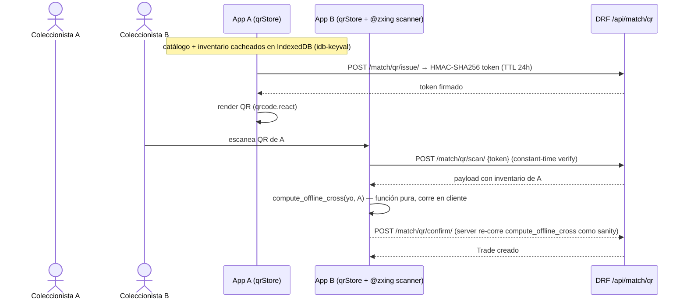
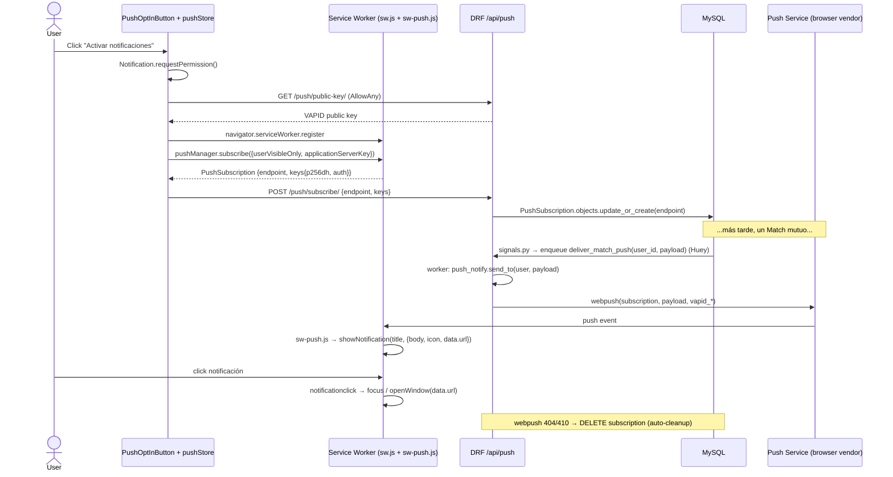
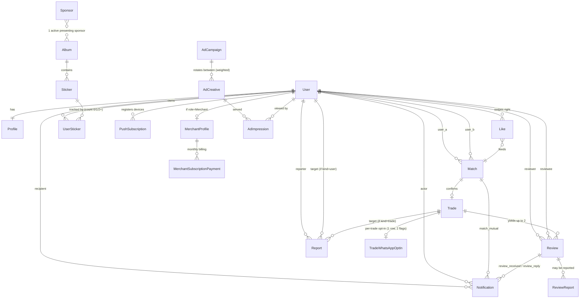
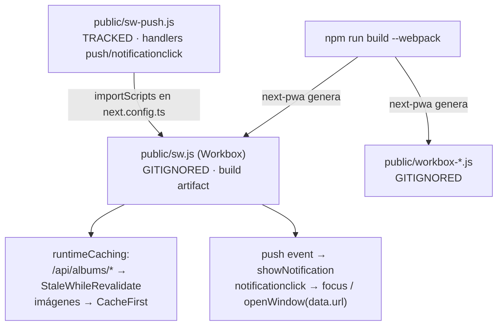
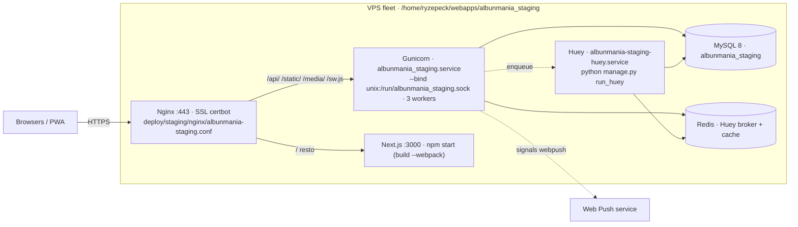
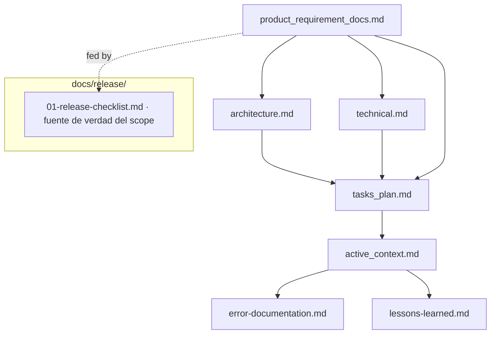

# Architecture — Albunmanía

> Snapshot 2026-05-12. Refleja Release 01 (14 épicas) + "Bloque D" (4 GAPS P2: páginas legales/FAQ, perfil `/profile/[id]`, centro de notificaciones in-app, reportes de usuarios/intercambios) + "Bloque E" (4 GAPS P3: presencia "en línea ahora"/Live Badge, Mapa de Coleccionistas, búsqueda predictiva con dropdown, GeoIP2 por IP) + "Bloque F" (limpieza + hardening: build verde, podadas las rutas/auth vestigiales del template, push de match → tarea Huey, filtros disponibilidad/proximidad en el catálogo, cobertura ~94%) + validación E2E + paquete `deploy/staging/`. **Los 8 GAPS de la auditoría de completitud están cerrados.**
> Counts: 19 models, 14 services, 21 view modules, 21 url modules (~66 `path()`), 12 migrations. Tests: 394 backend (cobertura ~94%) / 375 frontend unit / ~74 E2E.

## 1. System overview

```mermaid
flowchart TD
    subgraph Client["Browser / PWA instalada"]
        UI[Next.js 16 App Router<br/>React 19 + TS + Zustand 5]
        SW[Service Worker<br/>sw.js next-pwa + importScripts sw-push.js]
        IDB[(IndexedDB · idb-keyval<br/>cache catálogo offline<br/>cross-list QR presencial)]
    end

    subgraph Edge["Nginx (VPS)"]
        STATIC[Static + media · gzip]
        PROXY[Reverse proxy<br/>/api → gunicorn socket<br/>/ → Next.js :3000]
    end

    subgraph Backend["Django 6 + DRF (Gunicorn unix socket)"]
        API[REST API /api/ · ~66 paths · FBV @api_view]
        AUTH[JWT cookies + Google OAuth + hCaptcha + regla 30 días]
        ADMIN[Django Admin]
        SVC[Service layer · 14 servicios]
        SIG[Signals · Review aggregates · Match→Notification + enqueue push]
    end

    subgraph Async["Huey worker (albunmania-staging-huey)"]
        TASKS[deliver_match_push (Web Push del match) +<br/>backups/silk periódicos; stats nightly→V2]
    end

    subgraph Data["Persistencia"]
        MYSQL[(MySQL 8 · índices compuestos)]
        REDIS[(Redis · Huey broker + cache)]
        FILES[(Media · django-attachments + easy-thumbnails)]
        GEOIP[(MaxMind GeoIP2 DB local)]
    end

    subgraph External["Servicios externos"]
        GOOG[Google OAuth + People API]
        HCAP[hCaptcha]
        WAPP[WhatsApp deep links wa.me]
        SIIGO[Siigo / Alegra · facturación → V2]
        OSM[OpenStreetMap tiles · Leaflet]
        WPUSH[Web Push delivery W3C<br/>navegador del usuario]
    end

    UI <--> SW
    SW <--> IDB
    UI -->|HTTPS| PROXY
    PROXY --> API
    PROXY --> STATIC
    API <--> AUTH
    AUTH <--> GOOG
    AUTH <--> HCAP
    API <--> SVC
    SVC --> MYSQL
    SVC --> REDIS
    SVC --> FILES
    SVC --> GEOIP
    API --> SIG
    SIG --> MYSQL
    SIG -->|enqueue| TASKS
    API -->|enqueue| TASKS
    TASKS --> MYSQL
    TASKS -->|webpush| WPUSH
    TASKS --> SIIGO
    UI -->|deep link| WAPP
    UI -->|tiles| OSM
```

## 2. Request flows

### 2.1 Match swipe (Epic 3)

```mermaid
sequenceDiagram
    actor User_A
    participant FE as Next.js (matchStore)
    participant API as DRF /api/match
    participant DB as MySQL
    participant SIG as signals.py (post_save Match)
    participant HUEY as Huey worker (deliver_match_push)
    actor User_B (push)

    User_A->>FE: Abre /match (Swipe)
    FE->>API: GET /match/candidates/?radius_km=10
    API->>DB: bbox prefilter + haversine inline + cruce inventarios
    DB-->>API: top N coleccionistas compatibles
    API-->>FE: cards (incluye preview reseñas cacheado en Profile)
    FE->>User_A: Renderiza Swipe Card (+ banner CPM 1/5 swipes)
    User_A->>FE: Swipe right
    FE->>API: POST /match/like/ {target_user_id}
    API->>DB: get_or_create Like; create/lookup Match
    alt match mutuo (status=MUTUAL)
        API->>DB: Match.status = MUTUAL
        DB-->>SIG: post_save(created, status=MUTUAL)
        SIG->>DB: Notification.create para ambos
        SIG->>HUEY: enqueue deliver_match_push(user_id, payload)  (×2)
        HUEY->>DB: SELECT PushSubscription del user
        HUEY-->>User_B (push): webpush(build_match_mutual_payload)
        API-->>FE: {matched: true}
        FE->>User_A: diálogo "compartir WhatsApp?" (opt-in per-trade)
    else sin match aún
        API-->>FE: {matched: false}
    end
```

### 2.2 QR presencial offline (Epic 3)



### 2.3 Web Push opt-in + delivery (Epic 9)



## 3. ER Diagram — Modelos (19)



Archivos en `backend/albunmania_app/models/` (19): `user`, `profile`, `merchant_profile`, `album`, `sticker`, `user_sticker`, `sponsor`, `like`, `match`, `trade`, `trade_whatsapp_optin`, `merchant_subscription_payment`, `ad_campaign`, `ad_creative`, `ad_impression` (incluye `AdClick`), `review` (incluye `ReviewReport`), `push_subscription`, `notification`, `report`.

Migraciones (12): `0001_initial` → … → `0008_push_subscription` → `0009_notification` → `0010_report` → `0011_profile_last_seen` → `0012_delete_passwordcode`.

> `notification` y `report` se añadieron en el "Bloque D" (4 GAPS P2 de la auditoría 2026-05-12); `Profile.last_seen` en el "Bloque E" (presencia / Live Badge, 1 de los 4 GAPS P3 — los otros tres son endpoints sin modelo: `/presence/*`, `/collectors/*`, `/geo/ip-locate/`). El modelo `PasswordCode` (reset por email del template) se eliminó en el "Bloque F" — el producto es solo Google OAuth, no hay auth email/password. Ver `tasks/tasks_plan.md`.

**Constraints / invariantes críticos:**
- `Profile.rating_avg / rating_count / positive_pct` — agregados cacheados; recalculados por signal `post_save`/`post_delete` sobre `Review` (sólo cuenta `is_visible=True`). El endpoint público `users/<id>/public-profile/` expone estos + `% álbum` + `# trades completados` + `is_online`, nunca email/teléfono.
- `Profile.last_seen` (nullable, `db_index`) — presencia; bumpeado throttled (1 write/60s/usuario, vía cache) por `presence.touch` desde `presence_ping` y `validate_token`. `is_online` (property) = `last_seen` dentro de `presence.ONLINE_WINDOW` (5 min). `presence.active_collector_count(city=)` cuenta los `Profile` con `last_seen` en la ventana.
- `Profile.lat_approx / lng_approx` — coords *aproximadas* (jitter); las usa el match por proximidad (`match_engine`), el mapa de coleccionistas (`/collectors/map/` — sólo expone éstas, nunca una posición exacta del dispositivo) y el heatmap de analítica. Se setean en el onboarding (browser geo o `setGeoFromIp` desde `/geo/ip-locate/`).
- `Review` UNIQUE `(trade_id, reviewer_id)`; ventana de edición 24h post-creación; `is_visible=False` = hidden (no borrado) → excluido de agregados pero auditable.
- `ReviewReport` — cola de moderación de *reseñas*; el admin marca `is_visible=False` + razón.
- `Notification` — `kind` enum `match_mutual | review_received | review_reply`; FK opcionales `actor`/`match`/`review` (`SET_NULL`); `read_at` nullable (`is_read` property); índices `(user, read_at)` y `(user, -created_at)`. Creada por el signal `post_save Match(mutual, created)` (a ambos participantes, junto al Web Push) y por las views `trade_review_create` / `review_reply`. `notification_list` filtra siempre por `user=request.user`.
- `Report` — moderación *general*; `target_kind` enum `user | trade`, `reason` enum `no_show | harassment | fake_profile | inappropriate | other`, `status` enum `pending | dismissed | actioned` (+ `resolved_by`/`resolved_at`/`resolution_notes`); `CheckConstraint` `report_target_matches_kind` garantiza exactamente uno de `target_user`/`target_trade` según `target_kind`; `ordering = ['status', '-created_at']` + índice `(status, -created_at)`. `report_create` valida no-self (usuario) y participación-en-trade (trade); resolver es admin-only — las sanciones se aplican aparte en `/admin/users`.
- Sólo 1 `Sponsor` con `active_from <= now() <= active_until`.
- `UserSticker` UNIQUE `(user_id, sticker_id)` + índice compuesto; `count` 0/1/2+.
- `Match` UNIQUE par `(user_a, user_b)` normalizado; `status` enum `PENDING | MUTUAL`; `channel` enum `digital_swipe | qr_presencial` (Django 6: `CheckConstraint(condition=...)`, no `check=`).
- `TradeWhatsAppOptIn` — 1 fila por `Trade` con 2 flags (`a_opted_in`, `b_opted_in`); el deep link `wa.me` sólo si ambos. Teléfono digits-only.
- `MerchantSubscriptionPayment` — historial mensual; estado del listing derivado del último pago vigente.
- `AdImpression` — alto volumen durante el Mundial; pensada para partición por mes (V2). Rotación ponderada `creative.weight × campaign.weight`. `AdClick` registra el 302 redirect server-side. Frequency cap 1/5 swipes (client-side).
- `PushSubscription` — `endpoint` UNIQUE; `webpush` 404/410 → auto-delete.

## 4. Capas y boundaries

```mermaid
flowchart LR
    subgraph Presentation["Presentation Layer"]
        VIEWS[Views · 21 módulos · FBV @api_view]
        URLS[URLs · 21 módulos · ~66 path()]
    end
    subgraph DTO["DTO Layer"]
        SER[Serializers · list / detail / create_update]
    end
    subgraph Domain["Domain Layer"]
        SVC["Services · 13:<br/>match_engine, qr_token, qr_cross,<br/>whatsapp_link, stats_engine,<br/>merchant_subscription, ad_engine,<br/>review_aggregates, analytics_engine,<br/>push_notify, captcha_service,<br/>email_service, google_account_age"]
        UTIL[Utils · auth_utils, geo_utils,<br/>qr_signing, email registry]
    end
    subgraph Persistence["Persistence Layer"]
        MOD[Models · 18]
        SIG[Signals · review aggregates · match→notification+push]
    end

    URLS --> VIEWS
    VIEWS --> SER
    VIEWS --> SVC
    SER --> MOD
    SVC --> MOD
    SVC --> UTIL
    MOD --> SIG
    SIG --> MOD
    SIG --> SVC
```

Frontend (Next.js App Router): 20 `page.tsx`, 43 componentes (`components/{auth,onboarding,sponsor,catalog,match,whatsapp,stats,merchant,ads,reviews,push,manual,layout}`), 16 stores Zustand (`lib/stores/`). Locale logic en `proxy.ts` (Next.js 16: `middleware.ts` deprecado → `proxy.ts`). `themeColor` en `export const viewport` (no en `metadata`). `Header` usa patrón `mounted` para evitar hydration mismatch del estado derivado de cookies. `dev`/`build` requieren flag `--webpack` (next-pwa incompatible con Turbopack default).

## 5. PWA / Service Worker



Razón del split: `sw.js` se regenera en cada build (Workbox); si los handlers de push vivieran ahí se perderían. Solución (commit `a934125`): handlers en `public/sw-push.js` (tracked), `next.config.ts` los inyecta vía `importScripts: ['/sw-push.js']`; `sw.js` / `workbox-*.js` / `fallback-*.js` en `.gitignore`.

## 6. Deployment topology



Paquete `deploy/staging/` (commit `d7f2ec3`): `RUNBOOK.md` (9 pasos: secrets checklist → DB → clone+venv → backend `.env` → frontend build → Django setup → systemd → nginx+certbot → register `projects.yml` → smoke; + deploys subsecuentes, rollback, seed opcional), `systemd/{albunmania_staging,albunmania-staging-huey}.service`, `nginx/albunmania-staging.conf`, `projects.yml.snippet`, `env-templates/{backend.env,frontend.env.production}.example`, `scripts/{render-systemd.sh,deploy.sh}`. Settings prod: bloque `if not DEBUG:` con `SECURE_SSL_REDIRECT`, `SESSION_COOKIE_SECURE`, `CSRF_COOKIE_SECURE`, `SESSION_COOKIE_HTTPONLY`, `SECURE_CONTENT_TYPE_NOSNIFF`, `SECURE_BROWSER_XSS_FILTER`, `X_FRAME_OPTIONS='DENY'`, `SECURE_PROXY_SSL_HEADER`, HSTS opt-in vía `DJANGO_SECURE_HSTS_SECONDS`, `CSRF_TRUSTED_ORIGINS`. **Bloqueante para el deploy real (lo ejecuta ProjectApp/ops):** VAPID keypair nuevo (`vapid --gen`), Google OAuth Client ID + Secret reales, hCaptcha keys reales, `DJANGO_SECRET_KEY` + password MySQL.

## 7. Workflow de desarrollo (Memory Bank flow)



## 8. Decisiones arquitectónicas clave

| Decisión | Razón |
|----------|-------|
| **Single Django app** (`albunmania_app`) | El dominio cabe sin splitting; coherente con el template ya validado. Modelos divididos en archivos individuales bajo `models/`. |
| **Service layer (`services/`), views finas (FBV)** | Lógica de negocio testeable aislada del transporte HTTP. |
| **Multi-álbum como tenant lógico** (Album es la raíz, no schema/db) | Soporta Mundial 26 + Champions + Pokémon sin reescritura; cargar catálogo nuevo = INSERT. |
| **Match QR offline en cliente** (`compute_offline_cross` puro + idb-keyval) | Cero dependencia de red en cambiatones presenciales; el server re-corre la función como sanity check. |
| **WhatsApp deep links sin API empresarial** | Cero costo de WhatsApp Business; opt-in mutuo por trade respeta privacidad. |
| **JWT en cookies (`access_token`/`refresh_token`)** | No localStorage → menos superficie XSS; access corto + refresh largo balancea UX y revocación. |
| **AdImpression de alto volumen, rotación ponderada, frequency cap client-side** | La tabla crece rápido en el Mundial; partición por mes queda lista para V2. |
| **Web Push estándar W3C (pywebpush/py-vapid), sin Firebase** | Datos propios; no dependencia de Google FCM. Handlers en `sw-push.js` para sobrevivir al rebuild de `sw.js`. |
| **Reseñas con `is_visible` (soft hide)** | Trazabilidad histórica para auditoría sin afectar agregados públicos. |
| **next-pwa + `--webpack` obligatorio** | next-pwa no es compatible con Turbopack (default en Next.js 16); `sw.js` es build artifact gitignored. |
| **`proxy.ts` para locale** | Next.js 16 deprecó `middleware.ts`; tener ambos archivos rompe el build. |

## 9. Crecimiento previsto (visión v2 — fuente: release 01 §🌱)

| Eje | Preparación día 1 | Próximo paso |
|-----|-------------------|--------------|
| Tráfico | Nginx caché + SW catálogo (StaleWhileRevalidate) | Vertical scale → separar Huey VPS → CDN |
| Datos | Índices compuestos + AdImpression lista para partición | Archivado de álbumes inactivos cuando >10M UserSticker |
| Inventario ads | Rotación ponderada + segmentación geo desde día 1 | Self-service anunciantes; reportes PDF Sponsor/anunciantes |
| Multi-álbum | Album como tenant lógico | `champions.albunmania.co` subdomain por álbum si el tráfico exige |
| i18n | Stack es/en/pt + `messages/{es,en,pt}.json` poblados | Wiring real de `next-intl` (hoy copy hardcoded en español) |
| Async | Huey con MySQL/Redis backend | Workers dedicados por tipo (push / reports / billing); stats nightly; alertas KPI |
| Analítica | `analytics_engine` 7 funciones + CSV export | Instrumentación UTM + tabla `TrafficSource`; alertas de rendimiento |
| Admin | Roles + moderación + gestión campañas | Gestor de álbumes con CSV upload; gestor de creativas con UI |
| Facturación | `MerchantSubscriptionPayment` registrado | Integración Siigo/Alegra para facturas automáticas |
